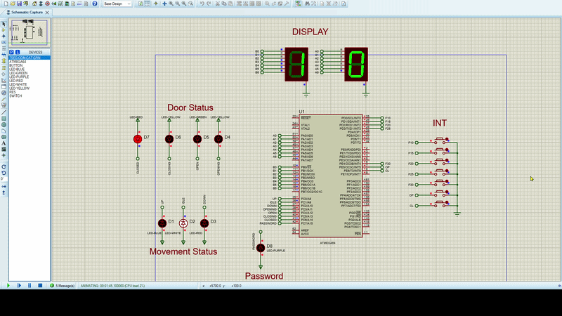
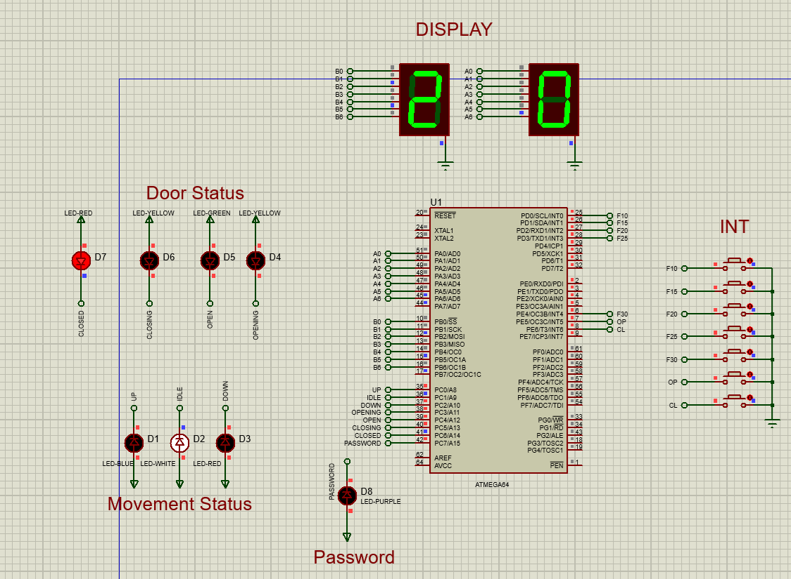

# 🏢 AVR Elevator Controller

An **AVR-based elevator controller** implemented in **Assembly language** and simulated in **Proteus**.  
This project demonstrates the logic of a multi-state elevator system, including floor display, movement indication, and door status indication.

---

## ✨ Project Highlights

- ⚙️ AVR Assembly implementation
- 🧠 Elevator control logic
- 🖥️ Proteus simulation project
- 🔢 Floor number display
- 🚦 Movement status indication
- 🚪 Door state indication
- 🎬 Animated demo included


---

## 🎬 Demo

The following GIF shows the project running in simulation:



---

## 🖼️ Circuit / Schematic Preview

The main circuit image is shown below:



---

## 📌 Project Description

This project implements a digital elevator controller using an AVR microcontroller and Assembly language.  
The system is designed to simulate the behavior of an elevator in a building environment.

The controller is responsible for:

- receiving floor requests
- updating the current floor display
- indicating the moving direction
- controlling elevator state transitions
- showing door status changes
- demonstrating the complete logic in a Proteus simulation

This repository contains both the source code and the simulation files required to study, run, and present the project.

---

## 🧰 Repository Contents
```text
elevator-controller-avr/
├── README.md
├── LICENSE
├── .gitignore
├── assets/
│   ├── P1.png
│   └── demo.gif.gif
├── code/
│   ├── main.asm
│   └── sisdig_2.atsln
└── proteus/
└── Sis_dig2.pdsprj
